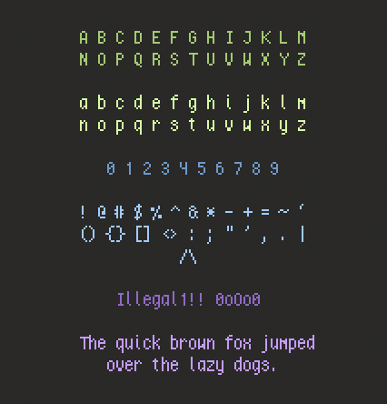

# Magicfont

Magicfont is a modification of artwiz'
[drift](https://en.wikipedia.org/wiki/Artwiz_fonts).
serifs have been smoothed, and changes have been made to the
'a','i','l','t','(', and ')' characters. Essentially, it's just a taller version
of [lemon](https://github.com/phallus/fonts).

 
